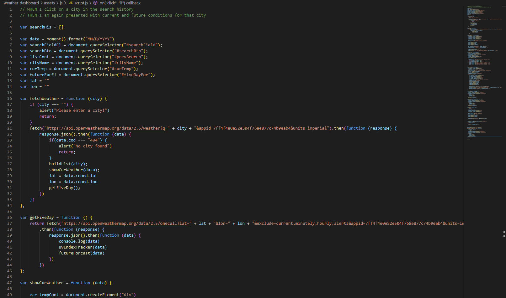
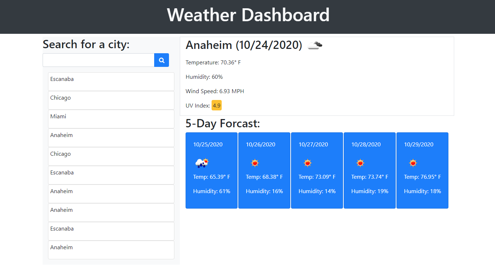

# weather-dashboard

## Description

This application takes live weather data from the OpenWeather map API at https://openweathermap.org/api and helps find current weather in searched areas. Using primarily JavaScript with slight CSS and HTML backing. Weather selections will save to localStorage to give you a history of what you have searched for in the past. Along with current weather conditions you will find a 5 day forcast perfect for planning a little day trip!

## Website

The live website can be found at https://uberbrent.github.io/weather-dashboard/

## Screenshots
Example screen of the live JS code:

Example of the application start screen:

